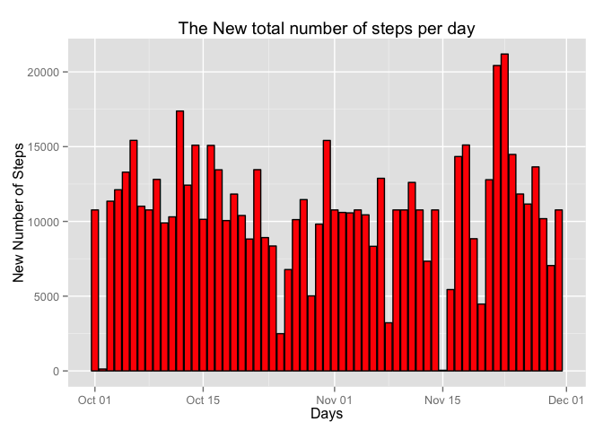
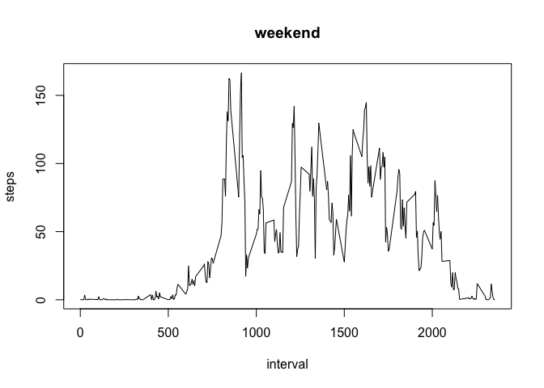
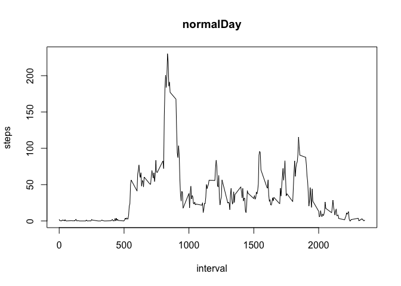

# Reproducible Research: Peer Assessment 1


## Loading and preprocessing the data

```r
actData <- read.csv(unz("activity.zip", "activity.csv"), 
                    colClasses = c("numeric", "character","integer"), header = T)
```

Parse date in the order year, month, and days 

```r
library(lubridate)
actData$date <- ymd(actData$date)
```

## What is mean total number of steps taken per day?

```r
totSteps <- tapply(actData$steps, actData$date, FUN = sum, na.rm = TRUE)
mean(totSteps)
```

```
## [1] 9354.23
```

Also the median could be calculated as follows


```r
median(totSteps)
```

```
## [1] 10395
```

For the total number of steps taken by day 

```r
library(plyr)
```

```
## 
## Attaching package: 'plyr'
## 
## The following object is masked from 'package:lubridate':
## 
##     here
```

```r
library(dplyr)
```

```
## 
## Attaching package: 'dplyr'
## 
## The following objects are masked from 'package:plyr':
## 
##     arrange, count, desc, failwith, id, mutate, rename, summarise,
##     summarize
## 
## The following objects are masked from 'package:lubridate':
## 
##     intersect, setdiff, union
## 
## The following object is masked from 'package:stats':
## 
##     filter
## 
## The following objects are masked from 'package:base':
## 
##     intersect, setdiff, setequal, union
```

```r
dailySteps <- print(summarize(group_by(filter(actData, !is.na(steps)), date), dailySteps = sum(steps)))
```

```
## Source: local data frame [53 x 2]
## 
##          date dailySteps
## 1  2012-10-02        126
## 2  2012-10-03      11352
## 3  2012-10-04      12116
## 4  2012-10-05      13294
## 5  2012-10-06      15420
## 6  2012-10-07      11015
## 7  2012-10-09      12811
## 8  2012-10-10       9900
## 9  2012-10-11      10304
## 10 2012-10-12      17382
## ..        ...        ...
```

The histogram for the total daily steps


```r
library(ggplot2)
ggplot(dailySteps, aes(x=date, y=dailySteps)) + 
        geom_histogram(stat="identity", colour = "black", fill = "green") +
        xlab("Days") + ylab("Number of Steps") + 
        labs(title= "Total number of steps per day") 
```

 


## What is the average daily activity pattern?
Calculating the average number of steps in each interval


```r
intervalAvgSteps <- print(summarize(group_by(filter(actData, !is.na(steps)), interval), intervalAvgSteps = mean(steps)))
```

```
## Source: local data frame [288 x 2]
## 
##    interval intervalAvgSteps
## 1         0        1.7169811
## 2         5        0.3396226
## 3        10        0.1320755
## 4        15        0.1509434
## 5        20        0.0754717
## 6        25        2.0943396
## 7        30        0.5283019
## 8        35        0.8679245
## 9        40        0.0000000
## 10       45        1.4716981
## ..      ...              ...
```

The time series plot of the 5-minute interval (x-axis) and the average number of steps taken, averaged across all days (y-axis)


```r
plot(intervalAvgSteps, type = "l", xlab = "The 5-minute Intervals", ylab = "Avg. number of steps", main = "The average number of steps across all days")
```

 

Which 5-minute interval, on average across all the days in the dataset, contains the maximum number of steps?


```r
actData$interval[max(intervalAvgSteps[2])]
```

```
## [1] 1705
```


## Imputing missing values
Calculating the total number of missing values for all the coloumns

```r
totMissingSteps       <- sum(is.na(actData$steps))
totMissingDates       <- sum(is.na(actData$date))
totMissingIntervals   <- sum(is.na(actData$interval))
print(totMissingSteps + totMissingDates + totMissingIntervals)
```

```
## [1] 2304
```
Note There are only missing values in the **steps** coloumn 


####I'll use the mean of the total number of steps in an interval to fill in the NA value's places 


```r
newData <- mutate(group_by(actData, interval), steps = ifelse(is.na(steps), 
                                           mean(steps, na.rm=TRUE), steps))
head(newData)
```

```
## Source: local data frame [6 x 3]
## Groups: interval
## 
##       steps       date interval
## 1 1.7169811 2012-10-01        0
## 2 0.3396226 2012-10-01        5
## 3 0.1320755 2012-10-01       10
## 4 0.1509434 2012-10-01       15
## 5 0.0754717 2012-10-01       20
## 6 2.0943396 2012-10-01       25
```

I'll get the new steps in a separate variable 

```r
newSteps <- print(summarize(group_by(newData, date), newSteps = sum(steps)))
```

```
## Source: local data frame [61 x 2]
## 
##          date newSteps
## 1  2012-10-01 10766.19
## 2  2012-10-02   126.00
## 3  2012-10-03 11352.00
## 4  2012-10-04 12116.00
## 5  2012-10-05 13294.00
## 6  2012-10-06 15420.00
## 7  2012-10-07 11015.00
## 8  2012-10-08 10766.19
## 9  2012-10-09 12811.00
## 10 2012-10-10  9900.00
## ..        ...      ...
```

Histogram for the new values


```r
ggplot(newSteps, aes(x=date, y=newSteps)) + 
        geom_histogram(stat="identity", colour = "black", fill = "red") +
        xlab("Days") + ylab("New Number of Steps") + 
        labs(title= "The New total number of steps per day") 
```

 

The mean of the new days

```r
newDailySteps <- tapply(newData$steps, newData$date, FUN = sum)
averageNewDailySteps <- mean(newDailySteps)
head(averageNewDailySteps)
```

```
## [1] 10766.19
```

The median of the new days

```r
medianNewDailySteps <- median(newDailySteps)
head(medianNewDailySteps)
```

```
## [1] 10766.19
```

#### We can notice from the results that both the mean and median differ now from the initial estimates, and we can prove it


```r
mean   (totSteps)   == mean   (newDailySteps)
```

```
## [1] FALSE
```

```r
median (totSteps)   == median (newDailySteps)
```

```
## [1] FALSE
```

#### We can show the impact of the imputed data using the summary subtraction of both cases [before/after] imputing the data


```r
summary(newDailySteps) - summary(totSteps)
```

```
##    Min. 1st Qu.  Median    Mean 3rd Qu.    Max. 
##      41    3041     370    1416       0       0
```

## Are there differences in activity patterns between weekdays and weekends?

#### Creating a new factor variable in the dataset with two levels – “weekday” and “weekend” indicating whether a given date is a weekday or weekend day.


```r
newData$whatDay <- as.factor(ifelse(weekdays(as.Date(newData$date)) %in% c("Saturday", "Sunday"), "weekend", "normalDay"))
summary(newData$whatDay)
```

```
## normalDay   weekend 
##     12960      4608
```


####Plotting the average number of steps/interval for both of weekdays and weekends 

```r
for (type in c("weekend", "normalDay")) {
    whatStep <- aggregate(steps ~ interval, data = newData, 
                            subset = newData$whatDay == type, FUN = mean)
    plot(whatStep, type = "l", main = type)
}
```

  


